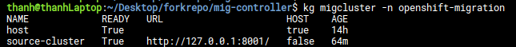
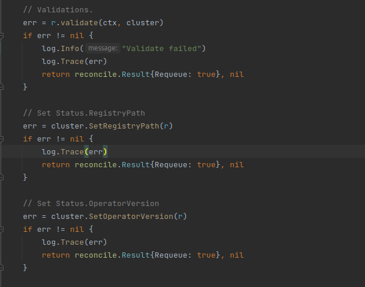
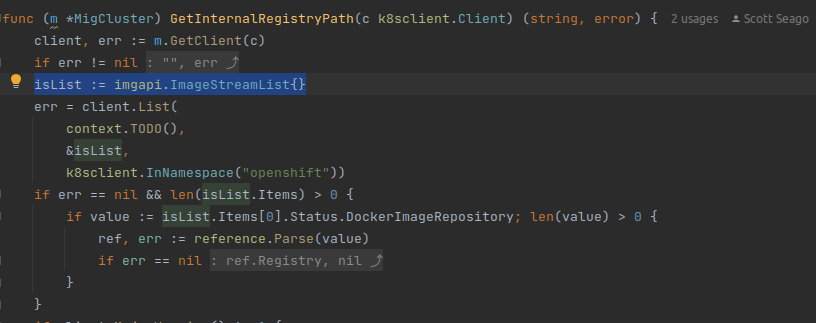
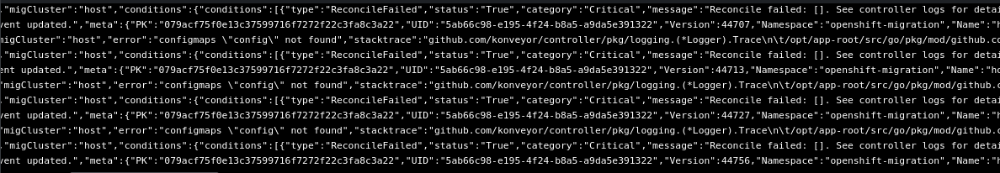
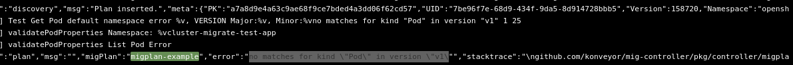
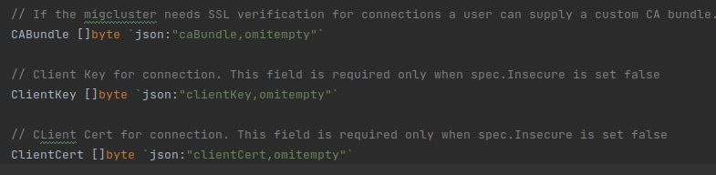
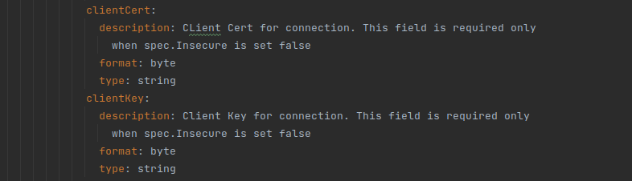

Luồng migrate khi xử dụng mig-controller là:
- Xác định source và destination cluster bằng CR MigCluster
- Xác định storage lưu trữ bằng CR MigStorage
- Tạo plan để migrate bằng CR MigPlan
- Thực hiện migrate bằng CR Migmigration

Để thực hiện migrate thì các CR phải có status READY=True. CR sẽ ready khi các CR của bước trước READY và các hàm validate+setup chạy thành công


### Migcluster
Khi reconcile, để có thể READY thì migcluster resource cần thực hiện thành công 3 hàm  


RegistryPath là path của ImageRegistry trong Openshift

Operator Version là version của Mig-Operator

Deploy host cluster
```yaml
apiVersion: migration.openshift.io/v1alpha1
kind: MigCluster
metadata:
  name: host
  namespace: openshift-migration
spec:
  isHostCluster: true
```



Để pass qua bước này thì em bỏ các hàm validate và setup đi

### Migstorage

Tạo secret từ gcp-credentials
```bash
kubectl create secret generic gcp-bucket-credentials --from-file=gcp-credentials -n openshift-migration
```
```yaml
apiVersion: migration.openshift.io/v1alpha1
kind: MigStorage
metadata:
  name: gcp-bucket
  namespace: openshift-migration
spec:
  backupStorageConfig:
    gcpBucket: amun
    credsSecretRef:
      name: gcp-bucket-credential
      namespace: openshift-config
```

### MigPlan

```yaml
apiVersion: migration.openshift.io/v1alpha1
kind: MigPlan
metadata:
  name: migplan-example
  namespace: openshift-migration
spec:
  destMigClusterRef:
    name: host
    namespace: openshift-migration
  indirectImageMigration: true
  indirectVolumeMigration: true
  migStorageRef:
    name: gcp-bucket
    namespace: openshift-migration
  namespaces:
    - test-app
  persistentVolumes:
    - capacity: 1Gi
      name: pvc-fb5acfb7-215c-4c0f-b066-cd71d6014857
      pvc:
        accessModes:
          - ReadWriteOnce
        hasReference: true
        name: pod-demo-deployment
        namespace: test-app
      selection:
        action: copy
        copyMethod: filesystem
        storageClass: standard
      storageClass: standard
      supported:
        actions:
          - copy
          - move
        copyMethods:
          - filesystem
  srcMigClusterRef:
    name: source-cluster
    namespace: openshift-migration
```
Migplan khi validatePodProperties thì gặp lỗi ```no matches for kind \"Pod\" in version \"v1\"```



Em nghĩ có thể do khi apply CR Mig-cluster của source cluster vào thiếu client-cert và client-key nên bị unauthorized.
```yaml
apiVersion: migration.openshift.io/v1alpha1
kind: MigCluster
metadata:
  name: source-cluster
  namespace: openshift-migration
spec:
  insecure: false
  # CA
  caBundle: ...
  isHostCluster: false
  url: 'https://117.1.29.65:443'
```

Em tạo thêm 2 trường cho Mig-ClusterSpec để thêm client cert và key

```make manifests```  
CRD: 
  

Apply lại source-cluster với cert và key 
```yaml
apiVersion: migration.openshift.io/v1alpha1
kind: MigCluster
metadata:
  name: source-cluster
  namespace: openshift-migration
spec:
  insecure: false
  # CA
  caBundle: ...
  clientCert: ...
  clientKey: ...
  isHostCluster: false
  url: 'https://117.1.29.65:443'
```
thì bị lỗi ```spec.clientCert in body must be of type byte``` do nó không convert từ string(CR) sang **byte array**. Em đang không biết controller convert kiểu gì.  

