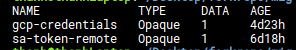

# Lab
## Cài đặt các thành phần
- Deploy 2 cụm K8s: 
  - Source cluster: k8s-vdt-2023 dedicated
  - Destination cluster: k8s-test managed
  - Resource migrated: [pod-pvc-demo.yaml](on-source-cluster/pod-pvc-demo.yaml)
    - ```echo hi > usr/share/nginx/html/hi.txt```
    - ```cat usr/share/nginx/html/hi.txt```
- Tạo resource để migrate trên cụm source:
```shell
kubectl creat ns cluster-migrate-test-app
kubectl apply -f pod-pvc-demo.yaml
```
- Tạo GCP bucket như trong [docs](https://github.com/vmware-tanzu/velero-plugin-for-gcp)
- Install Velero + restic trên hai cụm với câu lệnh
```shell
CLOUD_PROVIDER=gcp
STORAGE_PLUGIN=velero/velero-plugin-for-gcp:v1.8.0
BUCKET_NAME=mig-controller
CLOUD_CREDENTIALS=./gcp-credentials
MIGRATE_NAMESPACE=openshift-migration
```
```shell
velero install \
> --provider $CLOUD_PROVIDER\
> --plugins $STORAGE_PLUGIN\
> --bucket $BUCKET_NAME\
> --secret-file $CLOUD_CREDENTIALS\
> --uploader-type restic\
> --use-volume-snapshots false\
> --use-node-agent\
> --default-volumes-to-fs-backup\
> --namespace $MIGRATE_NAMESPACE
```

velero v1.7.1
```shell
velero install --provider gcp --plugins velero/velero-plugin-for-gcp:v1.3.1 --bucket mig-controller-demo --secret-file ~/Desktop/forkrepo/mig-controller/deployexample/gcp-credentials --use-volume-snapshots false --use-restic --default-volumes-to-restic true --namespace openshift-migration

```
- Deploy controller lên destination cluster:
```shell
cd ..
make docker-build
make docker-push
make 
```
- Thành phần trên source(remote) cluster: deployment velero và daemonsets node-agent  

- Thành phần trên destination(host) cluster: deployment velero, daemonsets node-agent và statefulset controller-manager  

## Thực hiện luồng migrate
### Source Cluster
- Tạo một service account ở namespace của velero và thêm cho nó quyền cluster-admin
```shell
kubectl create ns openshift-config
kubectl apply -f service-account.yaml
```
- Thêm và lưu token của service account vừa tạo. Token này sẽ được sử dụng bởi mig-controller để thực hiện các hành động:
```shell
kubectl apply -f secret-satoken-source.yaml
kubectl get secret mig-controller-sa-secret -n openshift-migration -o yaml 
```

### Destination Cluster
#### MigCluster
- Tạo một secret từ token vừa lưu với key và saToken và value là token vừa lưu
```shell
kubectl apply -f sa-token-remote.yaml
```
- Tạo 2 CR MigCluster để xác định 2 cụm migrate và check ready status:
  - host-cluster.yaml chỉ có một trường duy nhất isHostCluster: true
  - source-cluster.yaml sẽ có thêm 3 trường thông tin: url, CA và serviceaccount token của remote cluster để migcontroller có thể làm việc với source(remote) cluster
```shell
kubectl apply -f on-host-cluster/on-host-cluster.yaml
kubectl apply -f on-host-cluster/source-cluster.yaml
kubectl get migcluster -A
```

#### MigStorage
- Tạo một secret lưu giữ thông tin credential để truy cập vào s3 storage:
```shell
kubectl -n openshift-config create secret generic gcp-credentials --from-file gcp-credentials
```
Trong namespace openshift-config sẽ có 2 secret  

- Tạo CR MigStorage để xác định s3 storage cho velero:
```shell
kubectl apply -f migstorage-gcp.yaml
kubectl get migstorage -A
```

#### MigPlan
- Tạo CR MigPlan để xác định những thành phần sẽ được migrate:
```yaml
apiVersion: migration.openshift.io/v1alpha1
kind: MigPlan
metadata:
  name: migplan-example
  namespace: openshift-migration
spec:
  destMigClusterRef: ... 
  srcMigClusterRef: ...
  migStorageRef: ...
  indirectImageMigration: true 
  indirectVolumeMigration: true
  namespaces: ... #Namespace sẽ được migrate
  persistentVolumes: # PV được migrate
    - selection:
        action: copy # Action copy: backup dữ liệu sang s3 và restore ở destination cluster
        copyMethod: filesystem
        storageClass: standard # StorageClass của pv ở dest cluster
      capacity: 5Gi
      name: pvc-eb66ccb3-82cf-4516-a3bd-650799301fdc
      storageClass: csi-sc-viettelplugin-ssd # StorageClass của pv ở source cluster
      pvc: # Thông tin về pvc được migrate
        accessModes:
          - ReadWriteOnce
        hasReference: true
        name: pod-demo
        namespace: cluster-migrate-test-app
      supported:
        actions:
          - copy
        copyMethods:
          - filesystem
```
```shell
kubectl apply -f migplan.yaml
kubectl get migplan -A
```


#### MigMigration
- Trước khi migrate, ta cần tạo bằng tay một configmap để đổi storage class cho pvc:
```yaml
apiVersion: v1
kind: ConfigMap
metadata:
  # any name
  name: change-storage-class-config
  # namespace of velero deployment 
  namespace: openshift-migration
  labels:
    # this value-less label identifies the ConfigMap as
    # config for a plugin (i.e. the built-in change storage
    # class restore item action plugin)
    velero.io/plugin-config: ""
    # this label identifies the name and kind of plugin
    # that this ConfigMap is for.
    velero.io/change-storage-class: RestoreItemAction
data:
  #<old-sc>:<newsc>
  csi-sc-viettelplugin-ssd: standard
```
```shell
kubectl apply -f velero-configmap.yaml
```
- Apply default image cho stage Pod :
```yaml
apiVersion: v1
kind: ConfigMap
metadata:
  labels:
    control-plane: controller-manager
  name: migration-cluster-config
  namespace: openshift-migration
data:
  STAGE_IMAGE: "alpine:latest"
```
```shell
kubectl apply -f stage-pod-image-configmap.yaml
```
- Tạo CR MigMigration để mig-controller thực hiện migrate
```yaml
apiVersion: migration.openshift.io/v1alpha1
kind: MigMigration
metadata:
  name: migmigration-example
  namespace: openshift-migration
spec:
  migPlanRef:
    name: migplan-example
    namespace: openshift-migration
  stage: false # Thực hiện final migrate
  migrateState: false 
  quiescePods: true # Tạm dừng application khi migrate
```
```shell
kubectl apply -f mimigration.yaml
```

#### Quá trình:
- Nó sẽ dừng application được migrate:  

- Tạo backup ở cụm source:  

- Các velero resource được tạo trên s3:  

- Sau khi backup được replicated ở cụm, mig-controller tạo restore:

- Migrate thành công các object của k8s:

